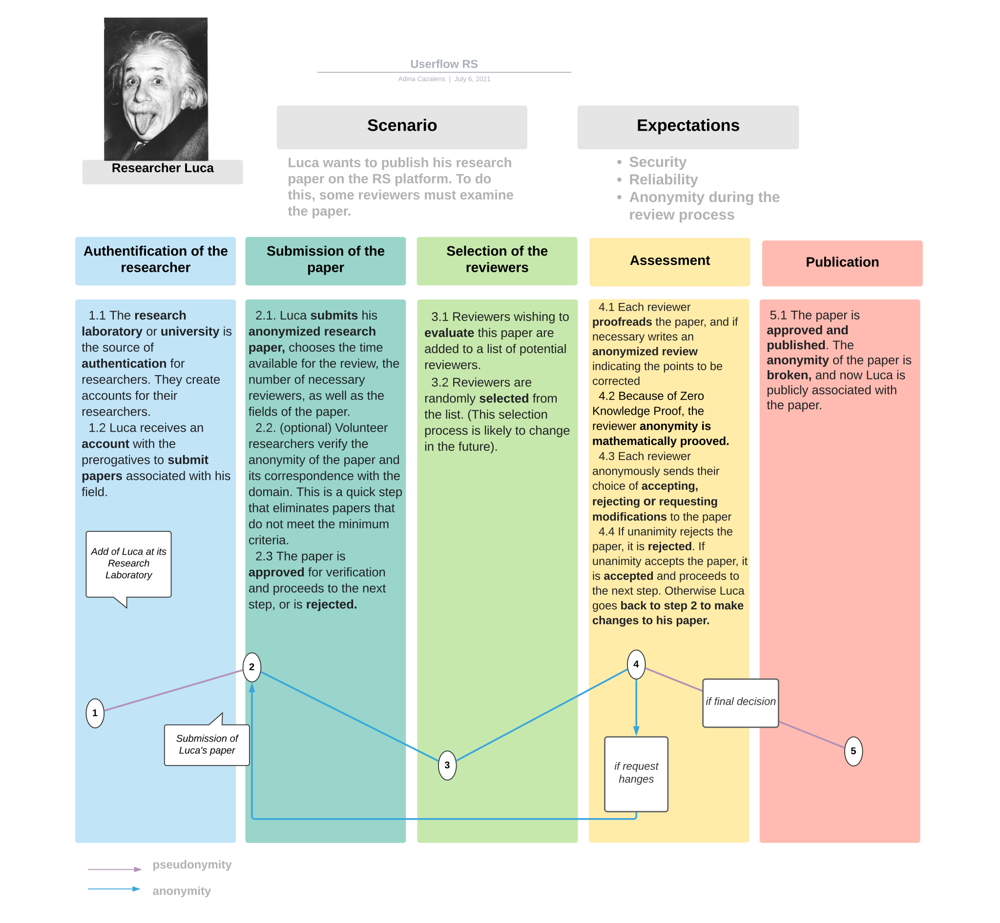

### Research Share

## Table of content

* [Introduction](https://www.github.com/PoCInnovation/ResearchShare-v2#Introduction)
* [Stack](https://www.github.com/PoCInnovation/ResearchShare-v2#Stack)
* [Userflow](https://www.github.com/PoCInnovation/ResearchShare-v2#Userflow)
* [Contributors](https://www.github.com/PoCInnovation/ResearchShare-v2#Contributors)

## Introduction

Research share is a plateform that aims at providing free researches ressources and improve the actual
editing process. Click [here](https://github.com/PoCInnovation/ResearchShare/blob/master/doc/Motives.md) if you want to learn more about our motivations and the why.

This project has the "v2" extension because it is the second iteration. You can find
the first version [here](https://github.com/PoCInnovation/ResearchShare)

## Stack

Apart from [the already existing stack of the first iteration](https://github.com/PoCInnovation/ResearchShare#stack), we are you using zokrates library to implement
Zero Knowledge Proof.

## Userflow

## Contributors

* [Adina Cazalens](https://github.com/NaadiQmmr)
* [Alexandre Chetrit](https://github.com/chetrit)
* [Alexandre Monier](https://github.com/ThalusA)
* [Lucie Philippon](https://github.com/Ersikan)
* [Matthis Cusin](https://github.com/Basilarc)
* [Quentin Veyrenc](https://github.com/VrncQuentin)

# Project Leader

[Luca Georges François](https://github.com/PtitLuca)
