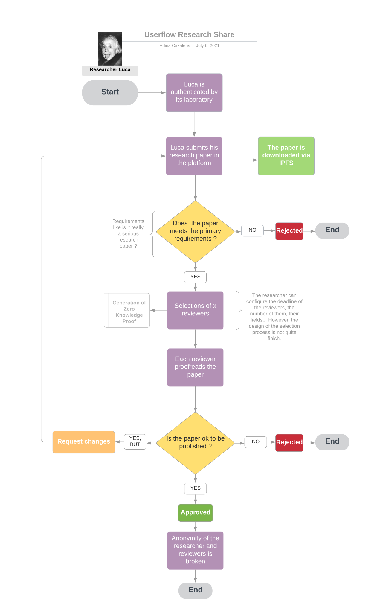

# Research Share

## Table of content

* [Introduction](./README.md#introduction)
* [Installation](./README.md#installation)
* [Quick Start](./README.md#quick-start)
* [Stack](./README.md#Stack)
* [Userflow](./README.md#Userflow)
* [Features](./README.md#Features)
* [Contributors](./README.md#Contributors)

## Introduction

Research share is a plateform that aims at providing free researches ressources and improve the actual
editing process. Click [here](https://github.com/PoCInnovation/ResearchShare/blob/master/doc/Motives.md) if you want to learn more about our motivations and the why.

This project has the "v2" extension because it is the second iteration. You can find
the first version [here](https://github.com/PoCInnovation/ResearchShare)

## Installation

## Quick Start

## Stack

* [IPFS](https://ipfs.io/) is used to store the research papers as a mean to decentralize the information.
* [Ethereum](https://ethereum.org/en/) & [Solidity]()https://soliditylang.org/ are used as backend. It allows us to run our logic in a resilient & trustless environment. However due to the current state of Ethereum (v2 is underway, huge gas fees, ...) the project may switch to another protocol in the future.
* [Zokrates](https://zokrates.github.io/) is used for [ZKSNARKS](https://en.wikipedia.org/wiki/Non-interactive_zero-knowledge_proof), during the review process.
* [ReactTS](https://www.typescriptlang.org/docs/handbook/react.html) is used for the front.
* [TruffleSuite](https://www.trufflesuite.com/ganache) is used to tests our contracts.
* [Docker](https://www.docker.com/) is used to deploy the platform via [compose](https://docs.docker.com/compose/).

## Userflow

## Features

### First Iteration

It took place from September 2020 to March 2021, a first team focused on the following points:

- [x] Draft of the process to submit a paper.
- [x] Draft of the Contracts.
- [x] Upload a file to IPFS & save its hash via the contracts.
- [x] Beginthe implementations of the contracts.
- [x] User registration (linked the to the contracts).
- [x] Submit/retrieve a paper.
- [x] Find reviewers (the best algorithm out there: random).
- [x] Submit a review.
- [x] Very basic front proving components for the features we implemented

### Second Iteration

- [ ] Define a proper way to select Reviewers for a paper & implement it.
- [x] Improve the submission process.
- [x] Prove the reviewers and researcher anonymity during the review process.
- [x] Improve users management.
- [ ] Migrate the first iteration
- [ ] Possibly, improve the front.

## Contributors

* [Adina Cazalens](https://github.com/NaadiQmmr)
* [Alexandre Chetrit](https://github.com/chetrit)
* [Alexandre Monier](https://github.com/ThalusA)
* [Lucie Philippon](https://github.com/Ersikan)
* [Matthis Cusin](https://github.com/Basilarc)
* [Quentin Veyrenc](https://github.com/VrncQuentin)

### Project Leader

[Luca Georges François](https://github.com/PtitLuca)
